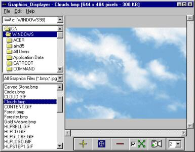



## Graphics\_Displayer

### Description

This is a common window's picture file formats viewer using streatchblt. It have zoomin/out, stretch, exact size and built-in slide. Also simple file management such as copy, rename and delete. Actually I wrote this project in attempt to compare the advantage of Stretchblt vs paintpicture and I thought it maybe useful to you. Feedback, comment, critics, idea are welcome.
 
### More Info
 

             |
---                |---
**Submitted On**   |2002-06-14 18:31:42
**By**             |[Mil\-X Pro](https://github.com/Planet-Source-Code/PSCIndex/blob/master/ByAuthor/mil-x-pro.md)
**Level**          |Intermediate
**User Rating**    |5.0 (15 globes from 3 users)
**Compatibility**  |VB 5\.0, VB 6\.0
**Category**       |[Graphics](https://github.com/Planet-Source-Code/PSCIndex/blob/master/ByCategory/graphics__1-46.md)
**World**          |[Visual Basic](https://github.com/Planet-Source-Code/PSCIndex/blob/master/ByWorld/visual-basic.md)
**Archive File**   |[Graphics\_D943936142002\.zip](https://github.com/Planet-Source-Code/mil-x-pro-graphics-displayer__1-35843/archive/master.zip)

